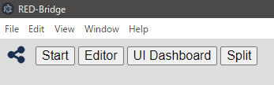
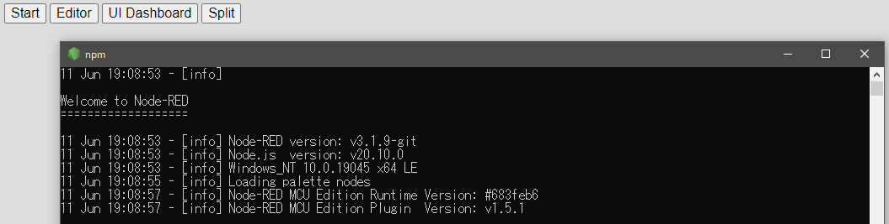
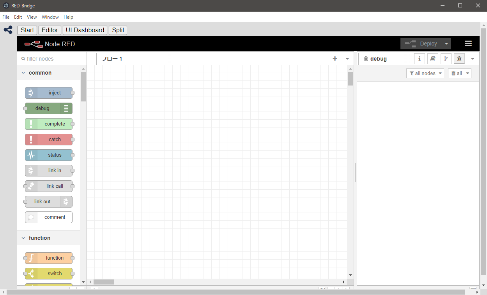

# GUI

Based my project: "code-planner"  
<https://github.com/404background/code-planner>

## Overview

This application is based on [Electron](https://www.electronjs.org/).  
Electron is a framework for building desktop applications using JavaScript, HTML, and CSS.  

In this application, you can use Node-RED Editor and UI Dashboard.  

## How to use

In directory of RED-Bridge, please run the following command.  
`npm run gui`  

You can find buttons.  
  

Please click "Start" button. Node-RED will start.  
  

Then, click "Editor" button. You will see the editor screen of Nod-RED.  
  

