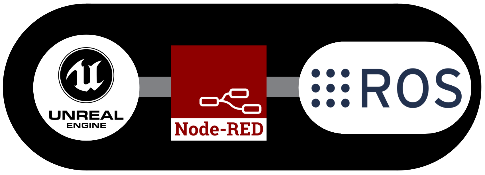

# RED-Bridge

Bridge to connect to any software by Node-RED

## Concept

I plan to use Node-RED to communicate with Unreal Engine and ROS for robot simulation and development.  
  

## Setup

**Only Windows is supported now.**  
In Windows folder, There are ps1 and bat files for setup.  
Please run these files.  

Double click in the File Explorer or run the following command in this directory:

```cmd
.\Windows\setup.ps1
.\Windows\npm-install.bat
```

For details, please read [Windows.md](./Windows/Windows.md).

## Test case

Windows 10/11
Unreal Engine 5.4.2

## GUI

You can use Node-RED with GUI application.  
For details, please read [GUI.md](./GUI/GUI.md).  

- [ ] Input port number
- [ ] Input IP address
- [ ] Expose the port with ngrok

## for Unreal Engine 5

Remote Control API HTTP Reference:  
<https://dev.epicgames.com/documentation/ja-jp/unreal-engine/remote-control-api-http-reference-for-unreal-engine?application_version=5.1>

You can use Remote Control API via Node-RED.

- [ ] Add sample flow
- [ ] Clone sample level

## for ROS

- [ ] Use MoveIt
